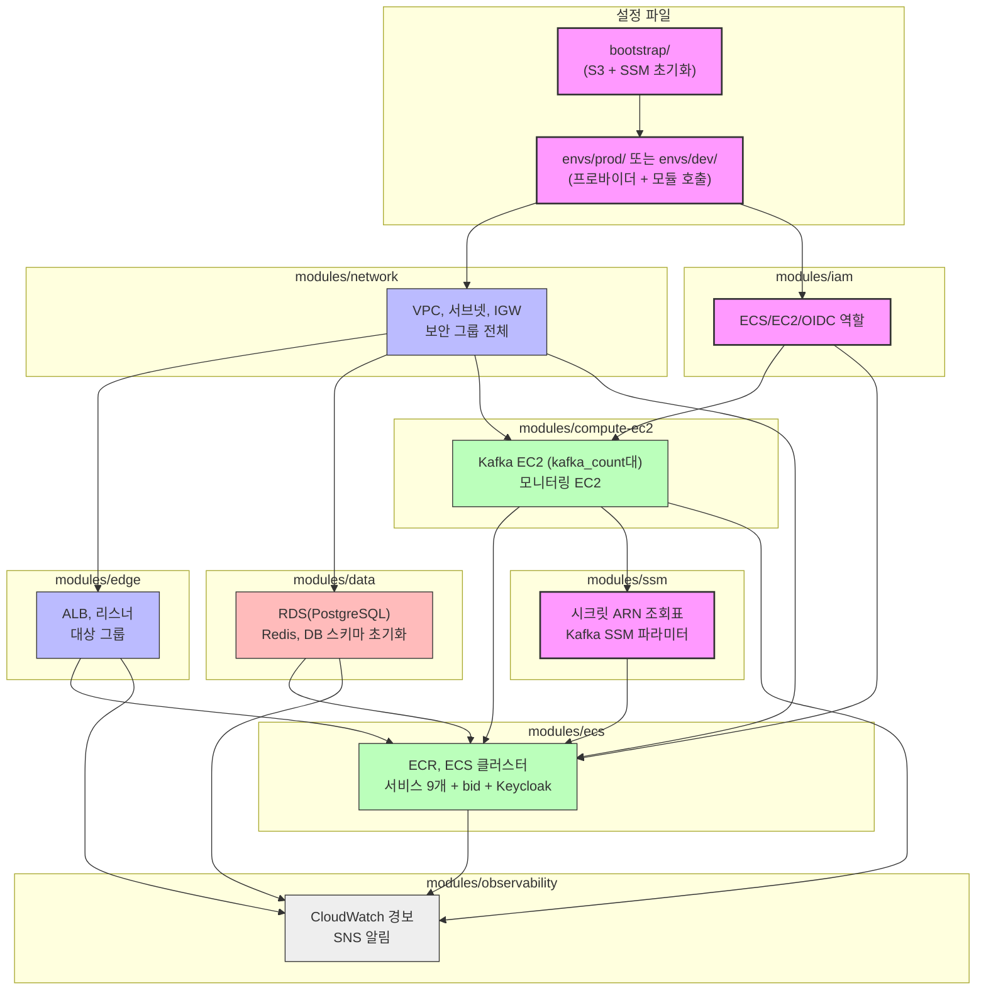

# 산지직경 Terraform 저장소

산지직경 프로젝트 배포를 위한 레포지토리입니다.

인프라 설계(VPC, ALB, ECS Fargate, RDS, ElastiCache, Kafka/모니터링 EC2, ECR, IAM, SSM)를 Terraform 코드로 옮긴 저장소입니다.

## 배포 방법

자세한 내용은 [DEPLOY.md](docs/DEPLOY.md)를 참고해 주세요.

S3 backend와 SSM Parameter Store를 먼저 만들어야 합니다. `bootstrap/` 폴더를 먼저 실행합니다.

```bash
# 1) S3 버킷 + SSM Parameter Store 생성 (최초 1회)
cd bootstrap
terraform init && terraform apply
cd ..
bash scripts/ssm-init.sh        # ssm-backup.json 생성
# ssm-backup.json에서 "CHANGE_ME"를 실제 값으로 교체합니다.
bash scripts/ssm-restore.sh     # ssm-backup.json 반영

# 2) 환경 폴더로 이동 후 인프라 배포 (prod 예시)
cd envs/prod                    # 개발 환경이면 envs/dev
cp terraform.tfvars.example terraform.tfvars
# terraform.tfvars에서 db_password, admin_cidr 등 필수값 채우기
terraform init
terraform plan
terraform apply

# 3) 인프라 제거 후 재배포 시 전체 복구 절차
terraform destroy
terraform apply
# GitHub Actions에서 Deploy EC2 수동 실행 (Kafka, 모니터링 EC2 배포)
# GitHub Actions에서 Deploy ECS 수동 실행 (workflow_dispatch)

# 4) SSM 파라미터 값 저장
# SSM Parameter Storage는 destroy되지 않기 때문에 별도로 저장할 필요는 없지만,
# 다른 곳으로 import할 필요가 있을 경우 아래 스크립트를 실행해주세요.
bash ../../scripts/ssm-backup.sh    # ssm-backup.json 파일 생성
bash ../../scripts/ssm-restore.sh   # ssm-backup.json 파일 적용
```

## 파일 구성

코드에 대한 자세한 설명은 [INTRODUCTION.md](docs/INTRODUCTION.md)를 참고해 주세요.

```
root
├── bootstrap/                 # S3 버킷 + SSM Parameter Store 생성 (최초 1회 실행)
├── scripts/
│   ├── ssm-backup.sh          # destroy 전 SSM 파라미터 값 백업
│   ├── ssm-restore.sh         # apply 후 SSM 파라미터 값 복구
│   ├── db-schema-init.sh      # RDS 스키마 초기화 (null_resource 경유 자동 실행)
│   └── (keycloak-setup.sh 삭제됨 - 메인 레포 scripts/로 이동)
├── docs/
│   ├── DEPLOY.md              # 단계별 배포 가이드 문서
│   └── INTRODUCTION.md        # 코드 설명 문서
│
│   # ----------------------------------------------------
│   # 환경 진입점: 여기서 terraform init/apply 실행
│   # ----------------------------------------------------
├── envs/
│   ├── prod/                  # 운영 환경 (S3 state key: prod/terraform.tfstate)
│   │   ├── main.tf            # 모듈 8개 호출
│   │   ├── variables.tf       # 변수 정의 (기본값: prod 사양)
│   │   ├── versions.tf        # 버전 고정 & S3 backend
│   │   ├── locals.tf / outputs.tf
│   │   └── terraform.tfvars.example
│   └── dev/                   # 개발 환경 (S3 state key: dev/terraform.tfstate)
│       ├── main.tf            # 모듈 8개 호출 (kafka_count=1, t3.micro)
│       ├── variables.tf       # 변수 정의 (기본값: dev 사양)
│       ├── versions.tf        # 버전 고정 & S3 backend
│       ├── locals.tf / outputs.tf
│       └── terraform.tfvars.example
│
│   # ----------------------------------------------------
│   # 모듈: 기능 단위로 분리된 리소스 묶음 (envs/*/가 공유)
│   # ----------------------------------------------------
└── modules/
    ├── network/               # VPC, 서브넷, IGW, 라우팅, 보안 그룹 전체
    ├── edge/                  # ALB, 대상 그룹, HTTP/HTTPS 리스너
    ├── compute-ec2/           # Kafka EC2 (kafka_count대), 모니터링 EC2
    ├── data/                  # RDS(PostgreSQL), ElastiCache(Redis), DB 스키마 초기화
    ├── ecs/                   # ECR, ECS 클러스터, 서비스 9개 + bid + Keycloak
    ├── observability/         # CloudWatch 경보, SNS 알림
    ├── iam/                   # ECS/EC2/GitHub Actions IAM 역할 전체
    └── ssm/                   # SSM 파라미터 생성 + bootstrap 시크릿 ARN 조회
```

## 레이아웃

> **분홍/보라**: 전체 인프라의 뼈대가 되는 설정 및 루트 파일
> 
> **파랑**: 네트워크/보안 모듈
> 
> **빨강**: 데이터 저장소 모듈
> 
> **초록**: 컴퓨팅/서비스 모듈
> 
> **회색**: 관측 가능성 모듈

