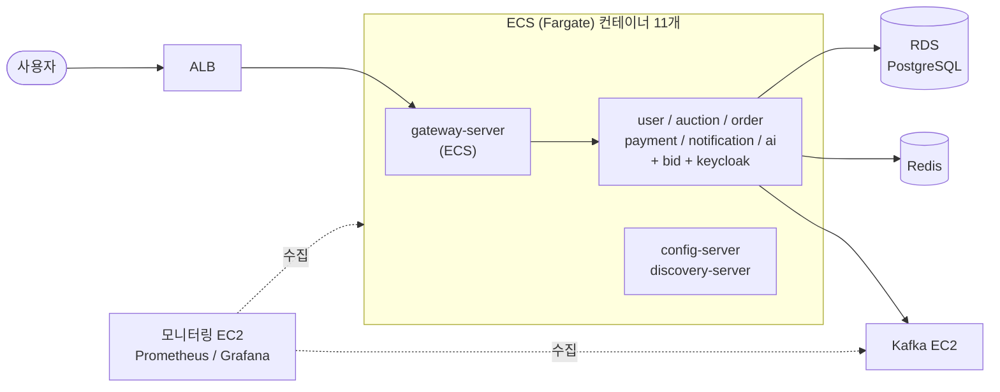
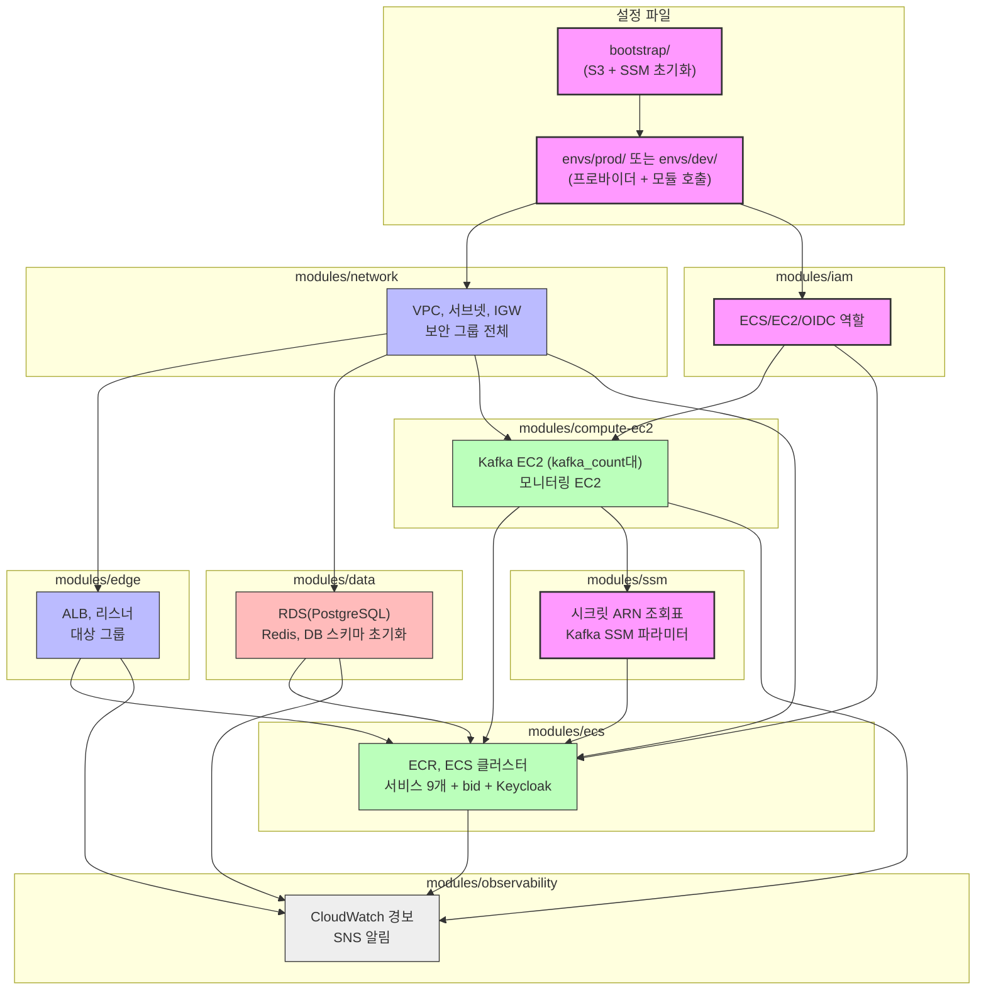

# 산지직경 인프라 레포지토리

산지직경 프로젝트 배포를 위한 Terraform 코드 저장소입니다.

---

## 무엇을 만드나요?

`terraform apply` 한 번으로 아래 AWS 자원 한 세트가 통째로 만들어집니다.

- **VPC / 네트워크**: 격리된 사설 네트워크와 서브넷, 보안 그룹
- **ALB**: 바깥에서 들어오는 요청을 받는 로드밸런서
- **ECS (Fargate)**: 애플리케이션 컨테이너 11개 (일반 서비스 9개 + 입찰 서비스 + Keycloak)
- **RDS (PostgreSQL)**: 메인 데이터베이스
- **ElastiCache (Redis)**: 캐시 및 분산 락
- **Kafka EC2**: 비동기 메시지 처리용
- **모니터링 EC2**: Prometheus + Grafana

요청이 흐르는 큰 그림은 다음과 같습니다.



> 설계 배경과 의사결정(로드밸런서 선택, DB 구성, 메시지 브로커 등)은 메인 레포의 [`docs/INFRASTRUCTURE.md`](https://github.com/BankRupang/san-ji-jik-kyeng/blob/main/docs/INFRASTRUCTURE.md)에 정리되어 있습니다.

---

## 관련 레포

이 프로젝트는 레포 2개로 나뉩니다. **이 레포는 인프라(그릇)만** 담당하고, 애플리케이션 코드와 컨테이너 배포는 메인 레포가 담당합니다.

| 레포 | 담당 | 주요 내용 |
| --- | --- | --- |
| **san-ji-jik-kyeng** (메인) | 애플리케이션 + 컨테이너 배포 | 서비스 소스 코드, `Deploy EC2` / `Deploy ECS` 워크플로우, 설계 문서(INFRASTRUCTURE.md) |
| **sanji-infra** (이 레포) | AWS 인프라 프로비저닝 | Terraform 코드, 배포 가이드 |

정리하면 **이 레포로 그릇(AWS 자원)을 만들고, 메인 레포의 워크플로우로 내용물(컨테이너 이미지)을 채우는** 구조입니다. 아래 배포 방법에 나오는 `Deploy EC2` / `Deploy ECS`는 모두 메인 레포의 GitHub Actions 워크플로우입니다.

---

## 사전 요구 사항

- **Terraform** v1.10 이상
- **AWS CLI** 설치 및 인증 (`aws sts get-caller-identity`로 확인)
- 인프라를 만들 수 있는 **IAM 권한** (처음이라면 관리자 권한이 가장 쉽습니다)

자세한 준비 절차는 [DEPLOY.md](docs/DEPLOY.md)의 "사전 준비물"을 참고해 주세요.

## 배포 방법

배포에 대한 자세한 설명은 [DEPLOY.md](docs/DEPLOY.md)를 참고해 주세요.

```shell
# 1) S3 버킷 + SSM Parameter Store 생성 (최초 1회)
cd bootstrap
terraform init
terraform apply
cd ..
bash scripts/ssm-init.sh        # ssm-backup.json 생성
# ssm-backup.json에서 "CHANGE_ME"를 실제 값으로 교체합니다.
bash scripts/ssm-push.sh        # ssm-backup.json 반영

# 2) 환경 폴더로 이동 후 인프라 배포 (prod 예시)
cd envs/prod                    # 개발 환경이면 envs/dev
cp terraform.tfvars.example terraform.tfvars
# terraform.tfvars에서 db_password, admin_cidr 등 필수값 채우기
terraform init
terraform plan
terraform apply

# 3) 인프라 제거 후 재배포 시 전체 복구 절차
terraform destroy
terraform apply
# 메인 레포(san-ji-jik-kyeng) GitHub Actions에서 Deploy EC2 수동 실행
# 메인 레포(san-ji-jik-kyeng) GitHub Actions에서 Deploy ECS 수동 실행
```

---

## 파일 구성

코드에 대한 자세한 설명은 [INTRODUCTION.md](docs/INTRODUCTION.md)를 참고해 주세요.

```bash
root
├── .github/workflows/
│   └── gemini_review.yml      # PR 자동 코드 리뷰 (Gemini)
├── prompts/
│   └── code_review.txt        # 코드 리뷰 프롬프트
├── bootstrap/                 # S3 버킷 + SSM Parameter Store 생성 (최초 1회 실행, state는 로컬 보관)
├── scripts/
│   ├── ssm-init.sh            # ssm-backup.json 템플릿 생성
│   ├── ssm-pull.sh            # destroy 전 SSM 파라미터 값 가져오기
│   ├── ssm-push.sh            # apply 후 SSM 파라미터 값 적용
│   ├── db-schema-init.sh      # RDS 스키마 초기화 (null_resource 경유 자동 실행)
│   ├── db-init.sh             # RDS 스키마 수동 복구용
│   ├── connect-rds.sh         # SSM 포트포워딩으로 RDS 접속
│   └── connect-redis.sh       # SSM 포트포워딩으로 Redis 접속
├── docs/
│   ├── DEPLOY.md              # 단계별 배포 가이드 문서
│   ├── OPERATIONS.md          # 배포 후 운영 가이드 (로그, 재배포, 경보 대응 등)
│   ├── STATE.md               # Terraform state 관리 (구조, 잠금, 복구)
│   └── INTRODUCTION.md        # 코드 설명 문서
│
│   # ----------------------------------------------------
│   # 환경 진입점: 여기서 terraform init/apply 실행
│   # ----------------------------------------------------
├── envs/
│   ├── prod/                  # 운영 환경 (S3 state key: prod/terraform.tfstate)
│   │   ├── main.tf            # 모듈 8개 호출
│   │   ├── variables.tf       # 변수 정의 (기본값: prod 사양)
│   │   ├── versions.tf        # 버전 고정 & S3 backend
│   │   ├── locals.tf / outputs.tf
│   │   └── terraform.tfvars.example
│   └── dev/                   # 개발 환경 (S3 state key: dev/terraform.tfstate)
│       ├── main.tf            # 모듈 8개 호출 (kafka_count=1, t3.micro)
│       ├── variables.tf       # 변수 정의 (기본값: dev 사양)
│       ├── versions.tf        # 버전 고정 & S3 backend
│       ├── locals.tf / outputs.tf
│       └── terraform.tfvars.example
│
│   # ----------------------------------------------------
│   # 모듈: 기능 단위로 분리된 리소스 묶음 (envs/*/가 공유)
│   # ----------------------------------------------------
└── modules/
    ├── network/               # VPC, 서브넷, IGW, 라우팅, 보안 그룹 전체
    ├── edge/                  # ALB, 대상 그룹, HTTP/HTTPS 리스너
    ├── compute-ec2/           # Kafka EC2 (kafka_count대), 모니터링 EC2
    ├── data/                  # RDS(PostgreSQL), ElastiCache(Redis), DB 스키마 초기화
    ├── ecs/                   # ECR, ECS 클러스터, 서비스 9개 + bid + Keycloak
    ├── observability/         # CloudWatch 경보, SNS 알림
    ├── iam/                   # ECS/EC2/GitHub Actions IAM 역할 전체
    └── ssm/                   # SSM 파라미터 생성 + bootstrap 시크릿 ARN 조회
```

## dev / prod 환경 차이

같은 모듈을 공유하되 변수값만 다르게 주어 두 환경을 만듭니다. 주요 기본값 차이는 다음과 같습니다. (모두 `terraform.tfvars`로 덮어쓸 수 있습니다.)

| 항목 | dev | prod |
| --- | --- | --- |
| VPC 대역 | `10.1.0.0/16` | `10.0.0.0/16` |
| Kafka 대수 | 1대 | 3대 |
| Kafka 사양 | `t3.micro` | `t3.medium` |
| 모니터링 EC2 | `t3.micro` | `t3.medium` |
| Fargate 배치 전략 | 100% Spot (`base=0`) | 첫 태스크 On-Demand + 나머지 Spot (`base=1`) |
| 입찰 서버 대수 | 1~2대 | 2~6대 |
| GitHub OIDC | 비활성 | 활성 |

> RDS(`db.t3.micro`)와 Redis(`cache.t3.micro`)의 기본 사양은 두 환경이 같습니다. 부하테스트 결과에 따라 `terraform.tfvars`에서 조정합니다.
> 월 예상 요금은 메인 레포 [`docs/INFRASTRUCTURE.md`](https://github.com/BankRupang/san-ji-jik-kyeng/blob/main/docs/INFRASTRUCTURE.md)의 "월 예상 비용"을 참고해 주세요.

---

## 레이아웃

> **분홍/보라**: 전체 인프라의 뼈대가 되는 설정 및 루트 파일
> 
> **파랑**: 네트워크/보안 모듈
> 
> **빨강**: 데이터 저장소 모듈
> 
> **초록**: 컴퓨팅/서비스 모듈
> 
> **회색**: 관측 가능성 모듈

