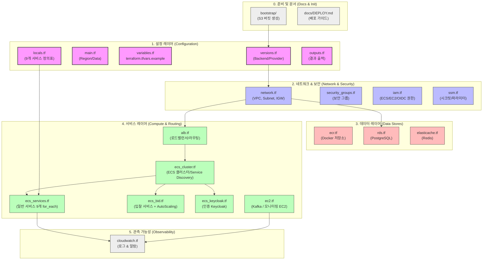

# 산지직경 Terraform 저장소

산지직경 프로젝트 배포를 위한 레포지토리입니다.

인프라 설계(VPC, ALB, ECS Fargate, RDS, ElastiCache, Kafka/모니터링 EC2, ECR, IAM, SSM)를 Terraform 코드로 옮긴 저장소입니다.

## 배포 방법

자세한 내용은 [DEPLOY.md](docs/DEPLOY.md)를 참고해 주세요.

S3 backend를 먼저 만들어야 합니다. `bootstrap/` 폴더를 먼저 실행합니다.

```bash
# 1) S3 버킷 생성 (최초 1회)
cd bootstrap
terraform init && terraform apply
cd ..

# 2) 본 인프라 배포
terraform init    # "로컬 상태를 S3로 옮길까요?" → yes
terraform plan
terraform apply

# 3) 인프라 제거 후 재배포 시 전체 복구 절차
bash scripts/ssm-backup.sh    # destroy 전 SSM 파라미터 백업
terraform destroy
terraform apply

bash scripts/ssm-restore.sh   # SSM 파라미터 복구
# GitHub Actions에서 Deploy EC2 수동 실행 (Kafka, 모니터링 EC2 배포)
bash scripts/jmx-setup.sh     # Kafka EC2에 JMX Exporter JAR 다운로드
bash scripts/db-init.sh       # RDS 스키마 초기화 (psql 스크립트 실행)
bash scripts/keycloak-setup.sh # Keycloak realm import + client-secret 발급 + SSM 저장
# GitHub Actions에서 Deploy ECS 수동 실행 (workflow_dispatch)
# ECR 이미지가 destroy 시 함께 삭제되므로 main push와 무관하게 수동으로 한 번 실행해야 앱이 기동됨
```

## 파일 구성

```
root
├── bootstrap/                 # [초기화] S3 버킷 생성 (최초 1회 실행)
├── scripts/
│   ├── ssm-backup.sh          # destroy 전 SSM 파라미터 값 백업
│   ├── ssm-restore.sh         # apply 후 SSM 파라미터 값 복구
│   ├── jmx-setup.sh           # Kafka EC2에 JMX Exporter JAR 다운로드
│   ├── db-init.sh             # RDS 스키마 초기화 (Kafka EC2 경유 psql 실행)
│   └── keycloak-setup.sh      # Keycloak realm import + client-secret 발급
├── docs/
│   └── DEPLOY.md              # [문서화] 단계별 배포 가이드
│
│   # ----------------------------------------------------
│   # 공통 및 환경 설정 (Configuration)
│   # ----------------------------------------------------
├── versions.tf                # 테라폼/프로바이더 버전 고정 & S3 backend 설정
├── main.tf                    # AWS 리전 설정 및 공통 데이터 조회(data source)
├── variables.tf               # 전역 변수 정의 목록
├── terraform.tfvars.example   # 전역 변수 입력 값 예시 파일
├── locals.tf                  # 서비스 정의표 (ECS 서비스 9개 통합 관리)
├── outputs.tf                 # 배포 완료 후 결과물(접속 주소 등) 출력
│
│   # ----------------------------------------------------
│   # 기본 네트워크 및 보안 (Network & Security)
│   # ----------------------------------------------------
├── network.tf                 # VPC, 서브넷, 인터넷 게이트웨이(IGW)
├── security_groups.tf         # 방화벽 보안 그룹(SG) 규칙
├── iam.tf                     # AWS 권한 역할 (ECS, EC2, GitHub Actions OIDC)
├── ssm.tf                     # 파라미터 스토어 / 시크릿 관리 보관함
│
│   # ----------------------------------------------------
│   # 데이터베이스 및 저장소 (Data Stores)
│   # ----------------------------------------------------
├── ecr.tf                     # Docker 컨테이너 이미지 저장소
├── rds.tf                     # RDS(PostgreSQL) 데이터베이스
├── elasticache.tf             # ElasiCache(Redis) 캐시 서버
│
│   # ----------------------------------------------------
│   # 애플리케이션 및 컴퓨팅 (Compute & Routing)
│   # ----------------------------------------------------
├── alb.tf                     # Application Load Balancer 및 라우팅 규칙
├── ecs_cluster.tf             # ECS 클러스터 및 서비스 디스커버리(Cloud Map)
├── ecs_services.tf            # 일반 ECS 서비스 9개 통합 배포 (for_each 사용)
├── ecs_bid.tf                 # 입찰 전용 서비스 + 전용 Auto Scaling 규칙
├── ecs_keycloak.tf            # Keycloak 인증 서버 전용 설정
├── ec2.tf                     # Kafka 및 모니터링용 전용 EC2 인스턴스
│
│   # ----------------------------------------------------
│   # 모니터링 (Observability)
│   # ----------------------------------------------------
└── cloudwatch.tf              # CloudWatch 로그 그룹 및 경보(Alarm) 설정
```

## 레이아웃

> **분홍/보라**: 전체 인프라의 뼈대가 되는 설정 및 네트워크/보안
> 
> **빨강**: 데이터베이스 및 저장소
> 
> **초록**: 실제 컨테이너 및 EC2가 구동되는 애플리케이션 영역

