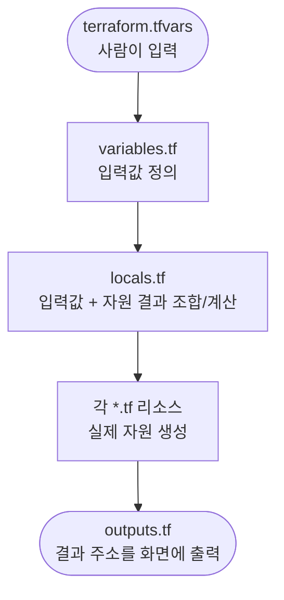

# Terraform 코드 가이드

이 문서는 `.terraform/` 폴더의 Terraform **코드 자체를 읽고 고칠 수 있도록** 설명합니다.
"인프라가 무엇인지"(아키텍처, 배포 절차)는 [DEPLOY.md](./DEPLOY.md)를 참고해주세요.

---

## 1. HCL 기초 문법

### 블록 4종류

| 블록 | 하는 일 | 예시 |
|---|---|---|
| `resource` | 실제로 만들 자원 1개 | `resource "aws_vpc" "main" { ... }` |
| `data` | 이미 있는 것을 **조회만** 함 (안 만듦) | `data "aws_caller_identity" "current" {}` |
| `variable` | 밖에서 받는 입력값(손잡이) | `variable "db_password" { ... }` |
| `locals` | 코드 안에서 계산해 쓰는 값 | `locals { name = "..." }` |

자원을 가리킬 때는 `타입.이름.속성`으로 씁니다.
예: `aws_vpc.main.id`는 "main이라는 VPC의 id". 이렇게 서로를 참조하면 Terraform이 "VPC를 먼저 만들고 그 id를 쓰는 자원을 나중에 만든다"는 순서를 **자동으로** 판단합니다. (의존성 자동 계산)

### 반복과 조건 3가지

| 기법 | 뜻 | 한 줄 요약 |
|---|---|---|
| `for_each` | 맵/집합을 돌며 자원을 **여러 개** 생성 | "표 한 줄당 자원 하나" |
| `count` | 숫자만큼 생성 (보통 0 또는 1) | "조건이 맞을 때만 생성" |
| `dynamic` | 자원 **안의 블록**을 조건부/반복 생성 | "이 서비스만 이 블록 추가" |

`for_each`를 쓰면 `each.key`(현재 키)와 `each.value`(현재 값)로 지금 도는 항목을 가리킵니다.

---

## 2. 값이 흐르는 큰 그림



`locals`는 **자원이 만들어진 뒤의 결과값**도 참조합니다.
예를 들어 RDS 주소(`aws_db_instance.main.address`)는 RDS를 만들기 전엔 모르는 값이라, 그걸 쓰는 환경변수는 `locals`에서 "RDS가 생긴 뒤" 조합됩니다.
그래서 locals가 단순 상수표가 아니라 조립 라인 역할을 합니다.

---

## 3. 핵심 패턴: 표 한 줄이 자원 여러 개가 되는 법

### 3-1. 정의표는 locals.tf에 있다

`locals.tf`의 `services`는 일반 서비스 9개를 적은 표(map)입니다. 한 줄이 서비스 하나입니다.

```hcl
services = {
  "config-server"   = { port = 8888, cpu = 512, ... }
  "user-service"    = { port = 19091, cpu = 2048, schema = "user_schema", redis = true, ... }
  ...
}
```

### 3-2. ecs_services.tf가 그 표를 for_each로 돌린다

`ecs_services.tf`의 리소스들은 모두 `for_each = local.services`로 같은 표를 돕니다.
**표에 줄을 하나 추가하면** 아래 4개가 그 서비스용으로 자동 생성됩니다.

| 리소스 | 무엇이 만들어지나 |
|---|---|
| `aws_cloudwatch_log_group.app` | 서비스별 로그 그룹 |
| `aws_service_discovery_service.app` | 서비스별 내부 DNS 이름 |
| `aws_ecs_task_definition.app` | 컨테이너 설계도 |
| `aws_ecs_service.app` | 실제로 컨테이너를 띄움 |

`each.key`는 서비스 이름("user-service"), `each.value`는 그 줄의 설정(`{port=..., cpu=...}`)입니다.
예: `each.value.port`는 그 서비스의 포트, `aws_cloudwatch_log_group.app[each.key]`는 그 서비스의 로그 그룹을 가리킵니다.

### 3-3. ECR 저장소도 같은 표에서 나온다

`ecr.tf`를 보면 저장소 목록을 직접 안 적고 `services`에서 가져옵니다.

```hcl
ecr_repos = toset(concat(keys(local.services), ["bid-service"]))
```

`keys(local.services)`는 표의 서비스 이름만 뽑은 목록이고, 거기에 `bid-service`를 더합니다.
**services 표에 줄을 추가하면 ECR 저장소도 자동으로 같이 생깁니다.**

> 새 서비스 추가 = `locals.tf`의 `services`에 한 줄 추가. 로그/DNS/태스크/서비스/ECR이 전부 따라옵니다.

---

## 4. 환경변수를 조립하는 merge() 로직

서비스마다 들어갈 환경변수가 다르고, `ecs_services.tf`의 `service_env`에서 `merge()`로 겹쳐 쌓습니다. `merge()`는 여러 맵을 합치되 **뒤에 온 것이 앞을 덮어씁니다.**

```hcl
service_env = {
  for name, s in local.services : name => merge(
    local.common_env,                          # (1) 모든 서비스 공통
    s.schema == null ? {} : { ...DB주소... },   # (2) DB 쓰는 서비스만
    s.redis  ? { ...Redis주소... } : {},        # (3) Redis 쓰는 서비스만
    s.kafka  ? { ...Kafka주소... } : {},        # (4) Kafka 쓰는 서비스만
    s.extra_env,                                # (5) 서비스 고유값 (맨 뒤=최우선)
  )
}
```

- `s.redis ? {...} : {}`는 "redis가 true면 Redis 주소를 넣고, 아니면 빈 맵"입니다. 표의 `redis = true` 한 칸이 환경변수 포함 여부를 결정합니다.
- `s.extra_env`가 맨 뒤라, 서비스 고유 설정이 공통값을 덮어쓸 수 있습니다.

> bid는 이 표에 없고 `ecs_bid.tf`에서 `bid_env`를 따로 같은 방식(`merge`)으로 만듭니다. bid는 DB/Redis/Kafka를 전부 쓰는 게 확정이라 조건 없이 다 넣습니다.

---

## 5. 시크릿을 코드에 안 적고 SSM ARN으로 연결하는 법

비밀번호/API 키는 코드에 직접 안 적습니다. `ssm.tf`가 시크릿 키 이름 → SSM 주소(ARN) 조회표를 만들고, 태스크 정의는 그 표를 보고 값을 끌어옵니다.

### 5-1. 조회표(secret_arns)가 만들어지는 과정

```hcl
secret_arns = merge(
  { "db-password" = aws_ssm_parameter.db_password.arn },          # 이 스택이 만든 것
  { for k, v in data.aws_ssm_parameter.app_secrets : k => v.arn },# bootstrap이 만든 것(조회만)
)
```

- `db-password`는 이 코드가 직접 만든 SSM 파라미터라 `aws_ssm_parameter`(resource)로 참조.
- 나머지(keycloak, toss, gemini 등)는 bootstrap에서 미리 만들어 둔 것이라 `data.aws_ssm_parameter`(조회)로 가져옴.
- 둘을 `merge`해서 하나의 조회표로 합칩니다.

### 5-2. 태스크 정의가 그 표를 쓰는 법

각 서비스의 `secrets = { 환경변수이름 = 시크릿키 }`를 돌면서 시크릿키를 ARN으로 바꿔 컨테이너에 주입합니다.

```hcl
secrets = [for env_name, key in each.value.secrets : { name = env_name, valueFrom = local.secret_arns[key] }]
```

예: `SPRING_DATASOURCE_PASSWORD = "db-password"`라고 적으면, 컨테이너의 `SPRING_DATASOURCE_PASSWORD` 환경변수에 `db-password`의 SSM 값이 들어갑니다.

---

## 6. count로 "있을 때만 만들기"

`count = 조건 ? 1 : 0`은 조건이 맞으면 1개, 아니면 아예 안 만드는 패턴입니다.

| 자원 | 조건 | 위치 |
|---|---|---|
| HTTPS 리스너, ALB 443 인바운드 | `acm_certificate_arn`이 비어있지 않을 때 | `alb.tf`, `security_groups.tf` |
| GitHub OIDC 프로바이더/역할 | `enable_github_oidc = true`일 때 | `iam.tf` |
| SNS 주제/이메일 구독 | `alert_email`이 비어있지 않을 때 | `cloudwatch.tf` |

`count`로 만든 자원은 `[0]`을 붙여 가리킵니다. 예: `aws_iam_role.github_actions[0].arn`.
`outputs.tf`에서도 `var.enable_github_oidc ? aws_iam_role.github_actions[0].arn : "(disabled)"`처럼 조건을 한 번 더 확인합니다. (없는 걸 가리키면 에러나기 때문)

---

## 7. dynamic 블록으로 "이 서비스만 이 블록 추가"

`dynamic`은 자원 **안의 블록**을 조건부로 넣거나 뺄 때 씁니다. `for_each`가 자원 전체를 반복한다면, `dynamic`은 자원 속 한 블록을 반복/조건 처리합니다.

gateway만 ALB에 붙어야 하므로 `ecs_services.tf`에서 이렇게 씁니다.

```hcl
dynamic "load_balancer" {
  for_each = each.value.alb ? [1] : []   # alb=true면 1번 돌고, 아니면 0번(블록 없음)
  content {
    target_group_arn = aws_lb_target_group.gateway.arn
    container_name   = each.key
    container_port   = each.value.port
  }
}
```

`for_each`에 `[1]`(원소 1개)을 주면 블록이 생기고, `[]`(빈 목록)을 주면 블록이 안 생깁니다.
`alb.tf`의 HTTP 리스너도 같은 방식으로, 인증서가 있으면 `redirect` 블록을, 없으면 그냥 forward를 씁니다.

---

## 8. 보안 그룹과 규칙을 일부러 떼어놓은 이유

`security_groups.tf`를 보면 보안 그룹 안에 인바운드 규칙을 직접 안 적고, 빈 그룹을 먼저 만든 뒤 `aws_security_group_rule`로 규칙을 따로 붙입니다.

```hcl
resource "aws_security_group" "ecs" { ... }            # 빈 그룹
resource "aws_security_group_rule" "ecs_in_from_alb" {  # 규칙은 따로
  source_security_group_id = aws_security_group.alb.id
  ...
}
```

**순환 참조** 때문입니다. ECS 그룹은 "모니터링 그룹에서 오는 트래픽"을 허용하고, 모니터링 그룹은 "ECS 그룹에서 오는 트래픽"을 허용합니다. 규칙을 그룹 안에 적으면 A가 B를 참조하고 B가 A를 참조해 Terraform이 순서를 못 정합니다.
규칙을 별도 자원으로 떼면 "그룹 2개를 먼저 다 만들고 규칙을 나중에 붙이는" 순서가 되어 순환이 풀립니다.

`egress_all`처럼 모든 그룹에 똑같이 붙는 규칙은 `for_each`로 한 번에 처리합니다.

---

## 9. lifecycle / ignore_changes (Terraform이 일부러 안 건드리는 것)

`lifecycle { ignore_changes = [...] }`는 "이 속성은 실제 값이 코드와 달라도 Terraform이 되돌리지 마라"는 뜻입니다.

| 위치 | 무엇을 무시 | 왜 |
|---|---|---|
| `aws_ecs_service`(모든 서비스) | `desired_count` | 오토스케일링이나 사람이 태스크 수를 바꿔도 Terraform이 되돌리면 안 됨 |
| `aws_instance`(EC2) | `ami` | 최신 AMI가 새로 나와도 EC2를 갈아엎지 않도록 |
| `bootstrap`의 시크릿 | `value` | 사람이 채운 실제 시크릿 값을 `CHANGE_ME`로 덮어쓰지 않도록 |

`prevent_destroy = true`(bootstrap의 S3, 시크릿)는 "이 자원은 실수로라도 삭제 못 하게 막아라"입니다.

---

## 10. t3 크레딧 경보

t3 계열(버스터블) 자원에만 "CPU 크레딧 20% 미만" 경보를 걸고, 고정형(m5 등)으로 바꾸면 자동으로 빠집니다.

```hcl
credit_alarms = {
  for k, v in local.credit_alarm_targets : k => merge(v, {
    threshold = lookup(local.t3_max_credits, reverse(split(".", v.type))[0], 576) * 0.2
  })
  if startswith(reverse(split(".", v.type))[1], "t")
}
```

- `split(".", v.type)`: 타입 문자열을 점 기준으로 쪼갬. `"cache.t3.micro"` → `["cache","t3","micro"]`.
- `reverse(...)`: 뒤집음 → `["micro","t3","cache"]`.
- `[0]`은 크기("micro"), `[1]`은 계열("t3"). 앞에 `cache.`/`db.`가 붙어도 뒤에서 세니 항상 같은 위치를 가리킵니다.
- `if startswith(...[1], "t")`: 계열이 "t"로 시작하는 것(t3, t3a, t4g)만 남김. m5/c5는 여기서 걸러져 경보가 안 생깁니다.
- `lookup(t3_max_credits, 크기, 576)`: 크기별 최대 크레딧 표에서 값을 찾고, 없으면 기본 576. 거기에 `* 0.2`로 20%를 임계값으로 잡습니다.

`treat_missing_data = "notBreaching"` 덕분에 고정형으로 바꿔 지표 자체가 사라져도 "데이터 없음"을 정상으로 처리합니다.

---

## 11. bid와 keycloak이 별도 파일인 이유

- **bid (`ecs_bid.tf`)**: `aws_appautoscaling_target`/`aws_appautoscaling_policy`로 태스크 수를 2~6개로 자동 조절합니다. 일반 서비스 템플릿엔 오토스케일링이 없어서 표로 못 찍어냅니다. `desired_count`도 `var.bid_min_capacity`로 시작합니다.
- **keycloak (`ecs_keycloak.tf`)**: 공개 이미지(`quay.io/keycloak/keycloak`)를 쓰고, `command`로 실행 모드를 직접 지정하며, 환경변수 구성도 Spring 서비스와 완전히 다릅니다. 표에 안 넣고 코드를 따로 적었습니다.

둘 다 로그 그룹/서비스 디스커버리를 만드는 모양은 일반 서비스와 같지만, `for_each` 없이 단일 자원으로 적혀 있다는 점만 다릅니다.

---

## 12. 파일별 코드 빠른 색인

| 보고 싶은 코드 | 파일 |
|---|---|
| 버전 고정, state 저장 위치(S3 backend) | `versions.tf` |
| 리전, 공통 태그, AMI 조회 | `main.tf` |
| 입력값(손잡이) 정의 | `variables.tf` |
| **services 정의표, 환경변수 조합, keycloak_url** | `locals.tf` |
| VPC/서브넷/라우팅 | `network.tf` |
| 보안 그룹 + 규칙(순환 참조 처리) | `security_groups.tf` |
| services 표를 도는 ECS 리소스, service_env, secrets 주입 | `ecs_services.tf` |
| bid 오토스케일링 | `ecs_bid.tf` |
| keycloak(공개 이미지) | `ecs_keycloak.tf` |
| ECR 저장소(services에서 목록 가져옴) | `ecr.tf` |
| count로 조건부 생성되는 OIDC, PassRole 등 | `iam.tf` |
| secret_arns 조회표 | `ssm.tf` |
| dynamic 리스너, 대상 그룹 | `alb.tf` |
| t3 크레딧 계산 경보 | `cloudwatch.tf` |
| 출력 주소 | `outputs.tf` |
| state용 S3 + 영구 시크릿(prevent_destroy) | `bootstrap/main.tf` |
